# Lab 1: Analyzing UE-gNB Connectivity in an OAI 5G SA Network

This report follows the lab checkpoint template and fills in the required answers, packet numbers, protocol roles, and evidence from `oai-5g-combined.pcapng`.

> Note: Screenshots are collected at the end of each checkpoint section. Existing image references were preserved and the missing opened-capture screenshot was added for Checkpoint 1.

---

# Checkpoint 1: Wireshark Setup and NR-RRC Decoding

## Answer

The `OAI-5G` Wireshark profile was installed and selected before opening the capture. The file `oai-5g-combined.pcapng` was then opened successfully.

After applying the display filter:

```wireshark
nr-rrc
```

Wireshark correctly decoded NR RRC packets, including `RRCSetupRequest`, `RRCSetup`, and `RRCSetupComplete`.

`NR RRC` means **New Radio Radio Resource Control**. It is the 5G NR Layer-3 control-plane protocol used between the UE and the gNB.

```text
UE  <---- RRC signaling ---->  gNB
```

The OAI-generated RAN packets appear as `127.0.0.1:9999 -> 127.0.0.1:9999`. These are synthetic packets generated for Wireshark analysis and are not the real UE or gNB network addresses. RRC uplink/downlink direction is used to distinguish UE and gNB behavior.

## Screenshots

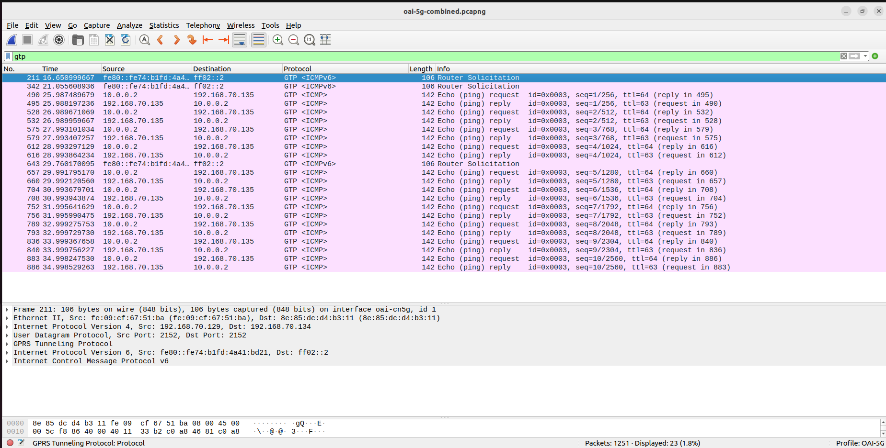


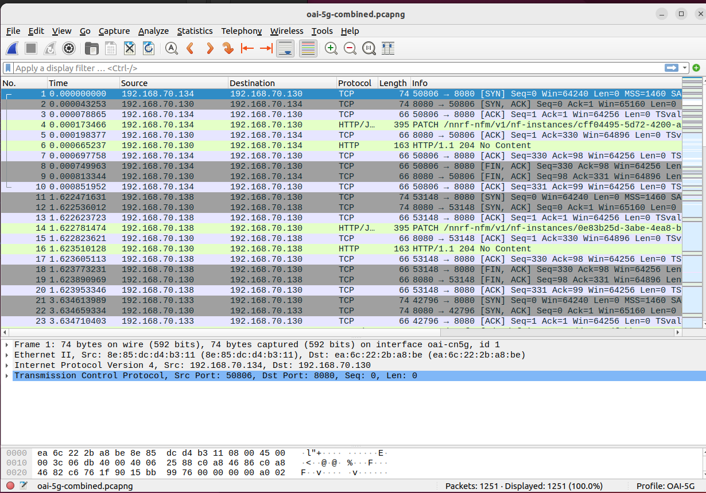

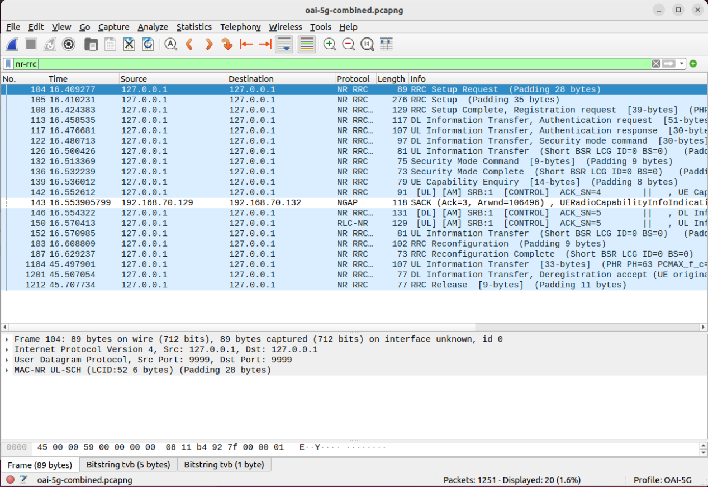

---

# Checkpoint 2: Basic 5G SA Architecture

## Component Identification

| Component | IP Address | Evidence from the Capture |
|---|---|---|
| UE PDU address | `10.0.0.2` | Packet 490: inner IPv4 source in GTP-U user-plane packet |
| gNB | `192.168.70.129` | Packet 110: NGAP `InitialUEMessage` source; Packet 490 outer IPv4 source |
| AMF | `192.168.70.132` | Packet 110: NGAP `InitialUEMessage` destination |
| UPF | `192.168.70.134` | Packet 490: outer IPv4 destination in GTP-U packet |
| Data Network | `192.168.70.135` | Packet 490: inner IPv4 destination / ICMP target |

## Interface Table

| Interface | Connected Components | Main Protocol | Purpose |
|---|---|---|---|
| N1 | UE <-> AMF, logically through the gNB | NAS-5GS | Registration, authentication, security, and session-management signaling |
| N2 | gNB <-> AMF | NGAP over SCTP | Control-plane signaling between the RAN and the 5G Core |
| N3 | gNB <-> UPF | GTP-U over UDP/2152 | Carries UE user-plane IP packets through a GTP-U tunnel |

## Explanation

Packet 110 shows NGAP signaling from `192.168.70.129` to `192.168.70.132`, identifying the gNB-to-AMF N2 path.

Packet 490 shows a GTP-U T-PDU. Its outer IPv4 header is `192.168.70.129 -> 192.168.70.134`, identifying the gNB-to-UPF N3 tunnel. Its inner IPv4 header is `10.0.0.2 -> 192.168.70.135`, identifying the UE PDU address and the Data Network endpoint.

N1 is logical UE-AMF NAS signaling. The UE does not physically send NAS directly to the AMF; NAS is carried over RRC between UE and gNB, then over NGAP between gNB and AMF.

## Screenshots

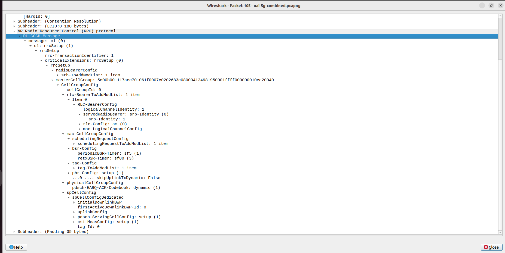

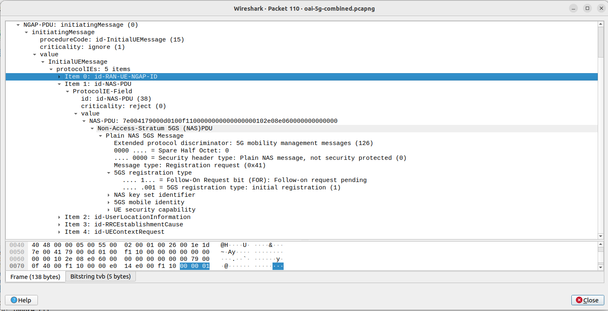

---

# Checkpoint 3: RRC Connection Establishment

## Completed RRC Message Table

| Message | Direction | Logical Channel / SRB | Main Purpose | Packet Number |
|---|---|---|---|---:|
| `RRCSetupRequest` | UE -> gNB | UL-CCCH / SRB0 | Requests RRC connection establishment and provides the initial UE identity and establishment cause | 104 |
| `RRCSetup` | gNB -> UE | DL-CCCH / SRB0 | Accepts the request and provides radio configuration, including SRB1 configuration | 105 |
| `RRCSetupComplete` | UE -> gNB | UL-DCCH / SRB1 | Confirms RRC setup completion and carries the NAS Registration Request | 108 |

## Packet Evidence

Packet 104 contains `RRCSetupRequest`:

```text
UL-CCCH-Message
 -> c1: rrcSetupRequest
     -> rrcSetupRequest
         -> ue-Identity: randomValue
         -> establishmentCause: mo-Signalling (3)
```

Packet 105 contains `RRCSetup`:

```text
DL-CCCH-Message
 -> c1: rrcSetup
     -> rrc-TransactionIdentifier: 1
     -> radioBearerConfig
         -> srb-ToAddModList
             -> srb-Identity: 1
```

Packet 108 contains `RRCSetupComplete`:

```text
UL-DCCH-Message
 -> rrcSetupComplete
     -> rrc-TransactionIdentifier: 1
     -> dedicatedNAS-Message
         -> Registration request (0x41)
```

The matching transaction ID `1` in Packets 105 and 108 shows that they belong to the same RRC setup transaction.

## Answers

1. The establishment cause in `RRCSetupRequest` is **`mo-Signalling (3)`**.
2. `RRCSetupRequest` uses **SRB0 over UL-CCCH** because SRB1 has not yet been established during the initial RRC connection request.
3. The **gNB** sends `RRCSetup` to the UE.
4. After the RRC connection is established, **SRB1** is used for dedicated signaling.
5. `RRCSetupComplete` carries a NAS **Registration Request (`0x41`)**.
6. At the end of this procedure, the UE is only RRC-connected to the gNB. It is **not yet registered with the 5G Core**, because authentication, NAS security, Registration Accept, and Registration Complete still need to occur.

## Screenshots


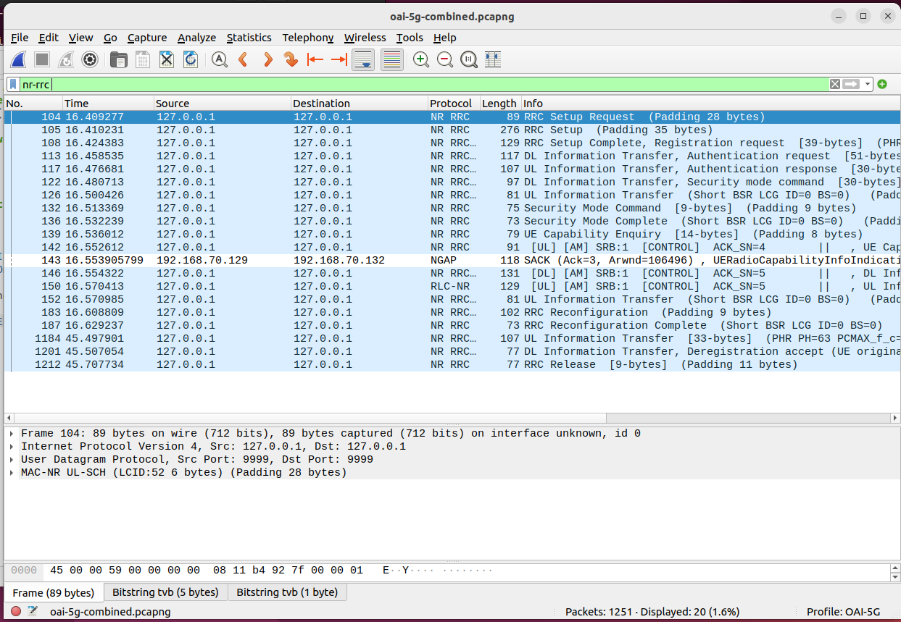

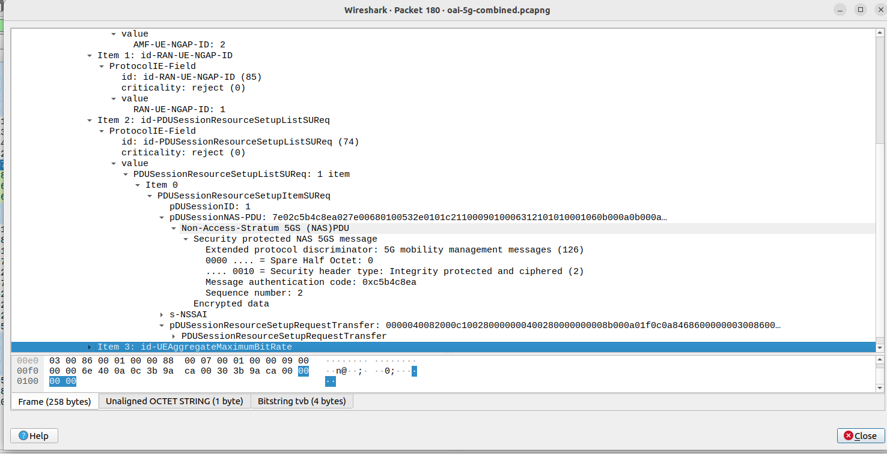

---

# Checkpoint 4: RRC-to-NGAP/NAS Mapping

## Radio-Side Registration Request

Packet 108 carries the NAS Registration Request inside `RRCSetupComplete`:

```text
RRCSetupComplete
 -> dedicatedNAS-Message
     -> NAS 5GS
         -> Registration request (0x41)
```

## Core-Side Registration Request

Packet 110 carries the same NAS Registration Request inside NGAP `InitialUEMessage`:

```text
NGAP InitialUEMessage
 -> protocolIEs
     -> id-NAS-PDU
         -> NAS-PDU
             -> Registration request (0x41)
```

## Mapping Table

| Stage | Protocol Message | Sender -> Receiver | Encapsulated Information |
|---|---|---|---|
| Radio side | `RRCSetupComplete`, Packet 108 | UE -> gNB | `dedicatedNAS-Message`: NAS Registration Request |
| Core side | NGAP `InitialUEMessage`, Packet 110 | gNB -> AMF | `NAS-PDU`: NAS Registration Request |

## Registration and Security Frames

| Message | Packet | Outer Procedure |
|---|---:|---|
| Registration Request | 110 | NGAP `InitialUEMessage` |
| Authentication Request | 112 | NGAP `DownlinkNASTransport` |
| Authentication Response | 118 | NGAP `UplinkNASTransport` |
| Security Mode Command | 120 | NGAP `DownlinkNASTransport` |
| Security Mode Complete | 128 | NGAP `UplinkNASTransport` |
| Registration Accept | 131 | NGAP `InitialContextSetupRequest`, NAS-PDU security protected |
| Registration Complete | 151 | NGAP `UplinkNASTransport`, NAS-PDU security protected |

Packets 131 and 151 are present in the expected registration stage, but the inner NAS messages are integrity protected and ciphered in the available Wireshark view. Therefore, their detailed NAS content cannot be directly decoded without NAS keys.

## Answers

1. The gNB acts as the access-network relay for NAS. It receives NAS carried in RRC from the UE and forwards the NAS-PDU to the AMF using NGAP. It also performs the reverse transport direction for downlink NAS.
2. **RRC** controls the UE-gNB radio connection and radio resources. **NAS** is logical UE-AMF signaling for registration, authentication, security, mobility, and session management.
3. The Registration Request is logical UE-to-AMF NAS signaling, but it is not delivered as a direct physical hop. The observed protocol path is:

```text
UE --RRCSetupComplete / dedicatedNAS-Message--> gNB
gNB --NGAP InitialUEMessage / NAS-PDU--> AMF
```

4. **Registration Complete** confirms that registration has completed successfully. In this capture, it is observed as the expected uplink NAS transport stage, but its inner NAS content is security protected/ciphered.

## Screenshots

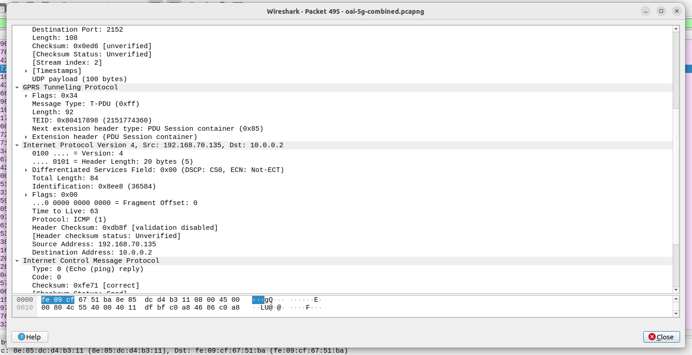


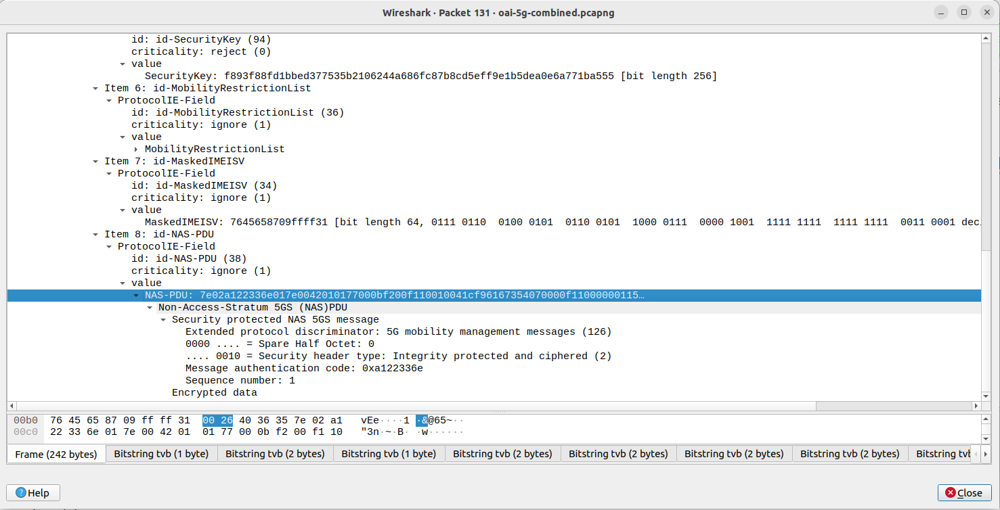

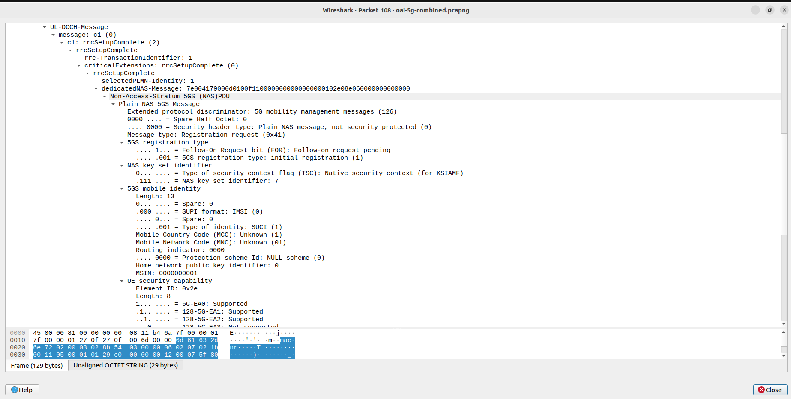

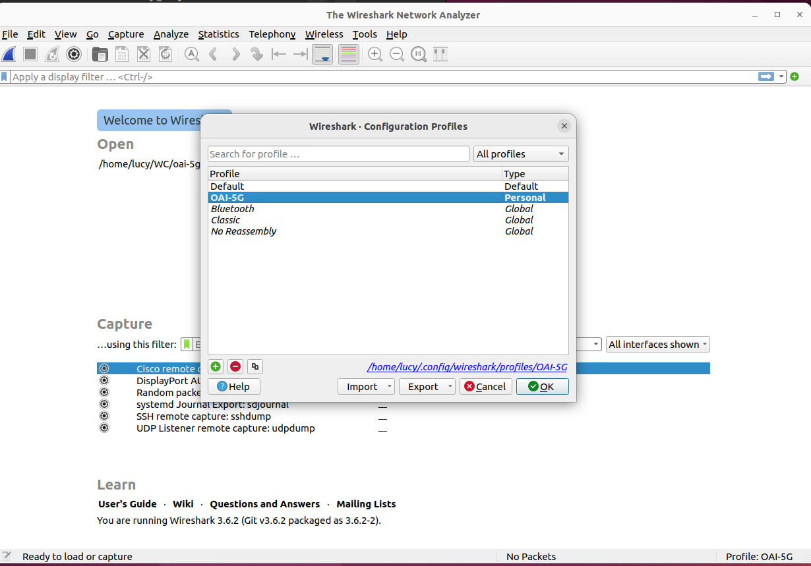

---

# Checkpoint 5: UE IP Address and User-Plane Traffic

## UE IPv4 Address

| Field | Observed Value |
|---|---|
| UE IPv4 address | `10.0.0.2` |

The UE IPv4 address is verified from the inner IPv4 header of the GTP-U packet in Packet 490:

```text
Inner IPv4 Source:      10.0.0.2
Inner IPv4 Destination: 192.168.70.135
```

The NAS `PDU Session Establishment Accept` is carried after NAS security is enabled, so the PDU address field is not directly decoded from the NAS message in the available view. The UE address is independently confirmed by user-plane traffic.

## ICMP Echo Request / Reply

The capture contains **10 ICMP Echo Request/Reply pairs**.

| Echo Request | Echo Reply | Sequence |
|---:|---:|---:|
| 490 | 495 | 1 |
| 528 | 532 | 2 |
| 575 | 579 | 3 |
| 612 | 616 | 4 |
| 657 | 660 | 5 |
| 704 | 708 | 6 |
| 752 | 756 | 7 |
| 789 | 793 | 8 |
| 836 | 840 | 9 |
| 883 | 886 | 10 |

Example pair:

| Direction | GTP-U Packet | Inner IP | Outer IP | TEID |
|---|---:|---|---|---|
| Echo Request, uplink | 490 | `10.0.0.2 -> 192.168.70.135` | `192.168.70.129 -> 192.168.70.134` | `0x00000003` |
| Echo Reply, downlink | 495 | `192.168.70.135 -> 10.0.0.2` | `192.168.70.134 -> 192.168.70.129` | `0x80417898` |

## Answers

1. The IPv4 address assigned to the UE is **`10.0.0.2`**.
2. There are **10 ICMP Echo Request/Reply pairs**.
3. The successful Echo Reply proves that the UE has working bidirectional user-plane IP connectivity through the gNB, UPF, and Data Network. It also confirms that the N3 GTP-U tunnel and forwarding path are working.

## Screenshots

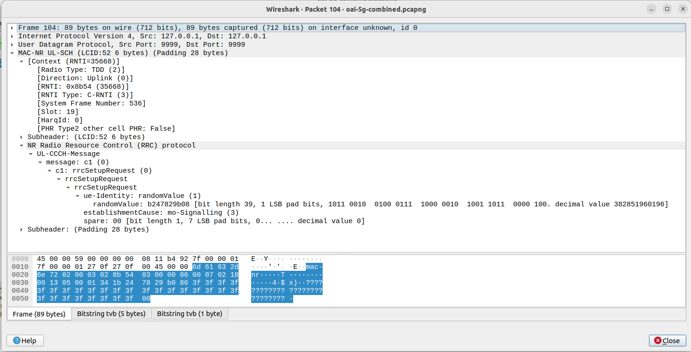

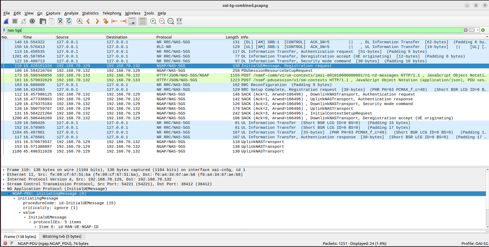

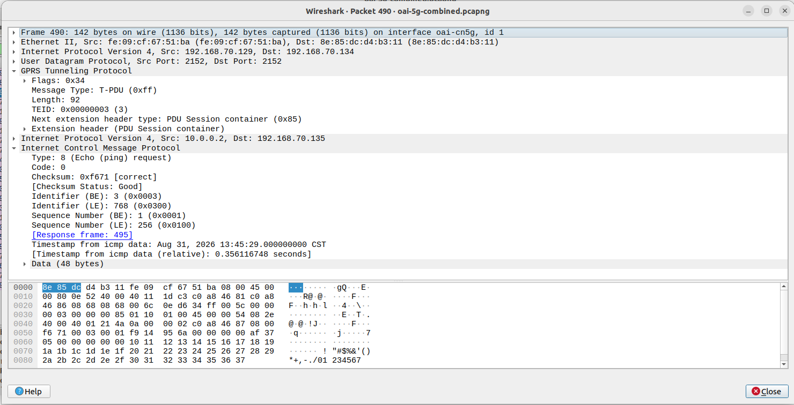

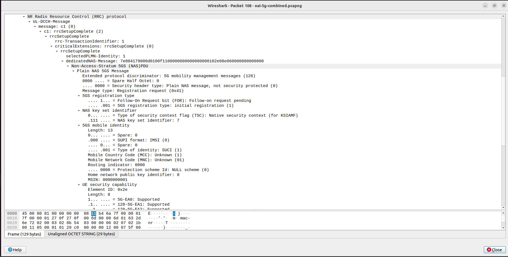

---

# Checkpoint 6: Final UE Connection Sequence

## Final Sequence Diagram

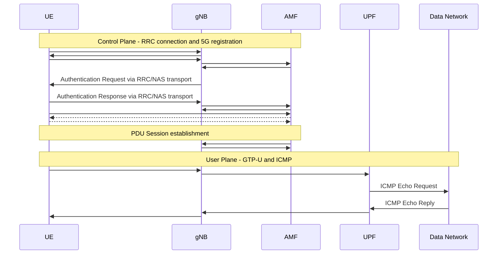

## Control-Plane vs User-Plane Distinction

**Control plane:**

- RRC between UE and gNB
- NAS logically between UE and AMF
- NGAP between gNB and AMF
- Registration, authentication, security, and PDU-session signaling

**User plane:**

- UE IP packets carried through GTP-U between gNB and UPF
- ICMP Echo Request / Reply used to verify end-to-end user-plane connectivity

## Screenshots

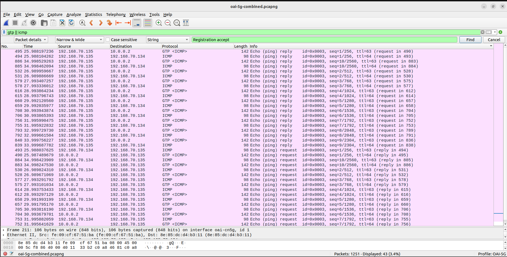

---

# Final Verification Summary

| Item | Status | Evidence / Limitation |
|---|---|---|
| OAI-5G Wireshark profile | Verified | Checkpoint 1 screenshots |
| NR-RRC decoding | Verified | `nr-rrc` filter |
| UE/gNB/AMF/UPF/DN identification | Verified | Packets 110 and 490 |
| RRCSetupRequest | Verified | Packet 104 |
| RRCSetup | Verified | Packet 105 |
| RRCSetupComplete | Verified | Packet 108 |
| NAS Registration Request in RRC | Verified | Packet 108 |
| NAS Registration Request in NGAP | Verified | Packet 110 |
| Authentication signaling | Verified | Packets 112 and 118 |
| Security Mode signaling | Verified | Packets 120 and 128 |
| Registration Accept | Observed as expected stage | Packet 131; inner NAS security protected |
| Registration Complete | Observed as expected stage | Packet 151; inner NAS security protected |
| PDU Session resource setup | Verified | Packets 180 and 188 |
| UE IPv4 address `10.0.0.2` | Verified from user plane | Packet 490 inner IPv4 |
| 10 ICMP request/reply pairs | Verified | Sequences 1-10 |
| GTP-U user-plane connectivity | Verified | Packets 490 and 495 |

---

# Conclusion

The capture shows the UE establishing an RRC connection with the gNB through Packets 104, 105, and 108. Packet 108 carries the NAS Registration Request inside RRC, and Packet 110 shows the gNB forwarding the same NAS message to the AMF through NGAP. Authentication and security signaling then occur, followed by PDU session resource setup. Finally, GTP-U and ICMP traffic confirm that the UE uses IPv4 address `10.0.0.2` and successfully exchanges user-plane traffic with the Data Network endpoint.
