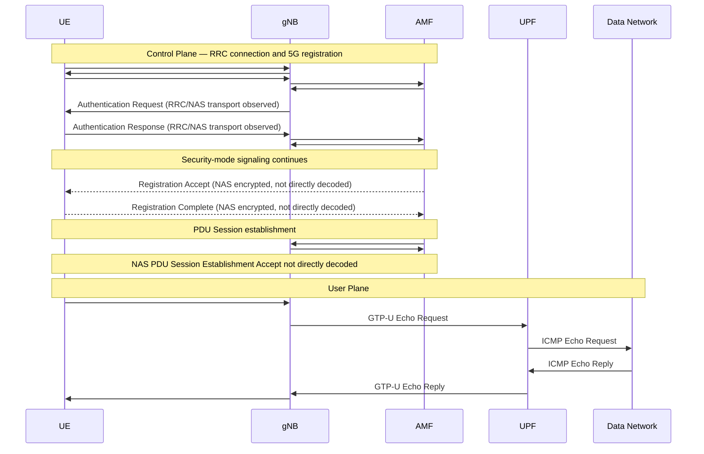

# Lab 1: Analyzing UE–gNB Connectivity in an OAI 5G SA Network

## 1. Lab Overview

This report analyzes how a UE establishes an RRC connection with an OAI gNB, starts 5G registration through the AMF, establishes user-plane connectivity, and exchanges ICMP traffic through GTP-U.

The main signaling path analyzed in this capture is:

```text
UE
 → RRC connection establishment
 → NAS Registration Request
 → gNB forwards NAS through NGAP
 → Authentication / Security signaling
 → PDU Session resource setup
 → UE obtains usable IP connectivity
 → GTP-U user-plane ping
```

> **Verification note:** Some NAS messages after security activation are integrity protected and ciphered in this capture. Therefore, `Registration Accept`, `Registration Complete`, the NAS `PDU Session Establishment Accept`, and the UE address inside that NAS message could not be directly decoded from the available packet view. These limitations are explicitly marked below. The UE IPv4 address is independently verified from the GTP-U inner IPv4 header.

---

# Checkpoint 1 — Wireshark Setup and NR-RRC Decoding

## 1.1 OAI-5G profile

The OAI-5G Wireshark profile was installed and selected.


## 1.2 Capture opened

The capture file `oai-5g-combined.pcapng` was opened successfully.


## 1.3 NR-RRC decoding

Display filter:

```text
nr-rrc
```

Wireshark correctly decodes NR RRC messages such as `RRCSetupRequest`, `RRCSetup`, and `RRCSetupComplete`.


### What is NR RRC?

`NR RRC` stands for **New Radio Radio Resource Control**. It is the 5G NR Layer-3 control-plane protocol between the UE and gNB.

```text
UE  <---- RRC signaling ---->  gNB
```

> The OAI-generated RAN packets appear as `127.0.0.1:9999 → 127.0.0.1:9999`. These are synthetic packets for Wireshark analysis and are not the actual UE and gNB network addresses. Uplink/downlink direction is used to distinguish UE and gNB in the final sequence diagram.

---

# Checkpoint 2 — Basic 5G SA Architecture

## 2.1 Network component identification

The five main components were identified using NGAP, GTP-U, and ICMP evidence.

| Component | IP Address | Evidence from Capture |
|---|---|---|
| UE PDU address | `10.0.0.2` | Packet 490: inner IPv4 source |
| gNB | `192.168.70.129` | Packet 110: NGAP `InitialUEMessage` source |
| AMF | `192.168.70.132` | Packet 110: NGAP `InitialUEMessage` destination |
| UPF | `192.168.70.134` | Packet 490: outer IPv4 destination |
| Data Network endpoint | `192.168.70.135` | Packet 490: inner IPv4 destination / ICMP target |

## 2.2 NGAP analysis

Display filter:

```text
ngap
```

Packet 110 contains an NGAP `InitialUEMessage`:

- Source: `192.168.70.129` — gNB
- Destination: `192.168.70.132` — AMF
- Transport: SCTP
- Destination SCTP port: `38412`

This is N2 control-plane signaling from the gNB to the AMF.


## 2.3 GTP-U analysis

Display filter:

```text
gtp
```

Packet 490 contains a GTP-U T-PDU carrying an ICMP Echo Request.

**Outer IPv4 header:**

- Source: `192.168.70.129` — gNB
- Destination: `192.168.70.134` — UPF
- UDP port: `2152`

**Inner IPv4 header:**

- Source: `10.0.0.2` — UE
- Destination: `192.168.70.135` — Data Network endpoint

The outer IP header identifies the N3 transport endpoints, while the inner IP header contains the UE's original user packet.


## 2.4 Interface table

| Interface | Connected Components | Main Protocol | Purpose |
|---|---|---|---|
| N1 | UE ↔ AMF | NAS-5GS | Registration, authentication, and session-management signaling |
| N2 | gNB ↔ AMF | NGAP | Control-plane signaling between RAN and 5G Core |
| N3 | gNB ↔ UPF | GTP-U | User-plane packet transport through GTP-U tunnels |

### N1

N1 is the **logical** UE–AMF NAS interface. NAS messages do not bypass the gNB; they are carried over RRC on the radio side and forwarded through NGAP on the core side.

### N2

N2 connects the gNB and AMF. Packet 110 provides direct evidence of NGAP signaling on this interface.

### N3

N3 connects the gNB and UPF. Packet 490 provides direct evidence of a GTP-U user-plane packet on this interface.

---

# Checkpoint 3 — RRC Connection Establishment

## 3.1 Completed RRC message table

| Message | Direction | Logical Channel / SRB | Main Purpose | Packet |
|---|---|---|---|---:|
| `RRCSetupRequest` | UE → gNB | UL-CCCH / SRB0 | Request RRC connection establishment | 104 |
| `RRCSetup` | gNB → UE | DL-CCCH / SRB0 | Provide RRC configuration, including SRB1 configuration | 105 |
| `RRCSetupComplete` | UE → gNB | UL-DCCH / SRB1 | Confirm RRC setup and carry NAS Registration Request | 108 |

## 3.2 Packet 104 — RRCSetupRequest

Observed fields:

```text
UL-CCCH-Message
 └─ c1: rrcSetupRequest
     └─ rrcSetupRequest
         ├─ ue-Identity: randomValue
         └─ establishmentCause: mo-Signalling (3)
```

`mo-Signalling` means that the UE initiates the RRC connection for signaling purposes.


## 3.3 Packet 105 — RRCSetup

Observed fields include:

```text
DL-CCCH-Message
 └─ c1: rrcSetup
     ├─ rrc-TransactionIdentifier: 1
     ├─ radioBearerConfig
     │   └─ srb-ToAddModList
     └─ ...
         └─ srb-Identity: 1
```

The message itself is delivered using SRB0, while its configuration establishes SRB1 for later dedicated signaling.


## 3.4 Packet 108 — RRCSetupComplete

Packet 108 shows:

```text
UL-DCCH-Message
 └─ rrcSetupComplete
     ├─ rrc-TransactionIdentifier: 1
     └─ dedicatedNAS-Message
         └─ Registration request (0x41)
             └─ initial registration (1)
```

The matching transaction ID (`1`) in Packets 105 and 108 shows that they belong to the same RRC transaction.


## 3.5 Answers to Section 6 questions

### Q1. What is the establishment cause in `RRCSetupRequest`?

`mo-Signalling (3)`.

### Q2. What SRB does `RRCSetupRequest` use? Why?

It uses **SRB0** over UL-CCCH because SRB1 has not yet been established during the initial RRC connection request.

### Q3. Which side sends `RRCSetup`?

The **gNB sends `RRCSetup` to the UE** using DL-CCCH / SRB0.

### Q4. Which signaling radio bearer is used after the RRC connection is established?

**SRB1** is used for dedicated signaling after it is configured by `RRCSetup`.

### Q5. Which NAS message is carried inside `RRCSetupComplete`?

NAS **Registration Request (`0x41`)**, with registration type `initial registration (1)`.

### Q6. At the end of this procedure, is the UE already registered with the 5G Core?

No. The UE has completed the **RRC connection establishment with the gNB**, but Packet 108 only starts the 5G Core registration procedure by carrying the initial NAS Registration Request. Further NAS signaling with the AMF is still required.

---

# Checkpoint 4 — RRC-to-NGAP/NAS Mapping

## 4.1 Radio-side Registration Request

Packet 108 carries the NAS Registration Request inside `RRCSetupComplete`:

```text
RRCSetupComplete
 └─ dedicatedNAS-Message
     └─ NAS 5GS
         └─ Registration request (0x41)
```


## 4.2 Core-side Registration Request

Packet 110 carries the same NAS Registration Request inside NGAP `InitialUEMessage`:

```text
NGAP InitialUEMessage
 └─ protocolIEs
     └─ id-NAS-PDU
         └─ NAS-PDU
             └─ Registration request (0x41)
```


## 4.3 Mapping table

| Stage | Protocol Message | Sender → Receiver | Encapsulated Information |
|---|---|---|---|
| Radio side | `RRCSetupComplete` (#108) | UE → gNB | `dedicatedNAS-Message`: Registration Request |
| Core side | NGAP `InitialUEMessage` (#110) | gNB → AMF | `NAS-PDU`: Registration Request |

This shows how the gNB relays a NAS message: RRC carries NAS between UE and gNB, and NGAP carries the NAS-PDU between gNB and AMF.

## 4.4 Authentication and Security signaling observed

The NAS/NGAP packet list shows subsequent signaling, including:

- Packet 112: `DownlinkNASTransport, Authentication request`
- Packet 118: `UplinkNASTransport, Authentication response`
- Packet 120: `DownlinkNASTransport, Security mode command`


## 4.5 Registration Accept / Registration Complete verification limitation

Packet 131 (`InitialContextSetupRequest`) contains a NAS-PDU, but Wireshark displays it as:

```text
Security protected NAS 5GS message
Security header type: Integrity protected and ciphered (2)
Encrypted data
```

Therefore, the inner NAS message type cannot be directly verified from this packet view.


**Status:**

- `Registration Accept`: required by the protocol/lab sequence, but **not directly decoded in the supplied packet evidence**.
- `Registration Complete`: required by the protocol/lab sequence, but **not directly decoded in the supplied packet evidence**.

## 4.6 Answers to Section 7 questions

### Q1. What is the role of the gNB when it transports NAS messages?

The gNB acts as the access-network relay between the UE and AMF. It receives NAS signaling carried over RRC from the UE and forwards the NAS-PDU to the AMF using NGAP, and performs the reverse operation for downlink NAS signaling.

### Q2. What is the difference between RRC and NAS signaling?

- **RRC:** control signaling between UE and gNB for radio connection and radio resource control.
- **NAS:** signaling logically between UE and AMF for registration, authentication, mobility, and session management.

### Q3. Is the Registration Request delivered directly from the UE to the AMF?

Not as a direct physical network hop. Logically it is UE–AMF NAS signaling, but the observed transport path is:

```text
UE --RRC/dedicatedNAS-Message--> gNB --NGAP/NAS-PDU--> AMF
```

### Q4. Which message confirms that Registration has completed successfully?

`Registration Complete` is the UE confirmation message. In this capture, its inner NAS message was **not directly verified** because later NAS signaling is security protected/ciphered in the available packet view.

---

# Checkpoint 5 — UE IP Address and User-Plane Traffic

## 5.1 PDU Session resource setup

Packet 180 is an NGAP `PDUSessionResourceSetupRequest` from AMF to gNB and includes PDU Session ID `1` plus a NAS-PDU. However, the NAS-PDU is encrypted:

```text
Security protected NAS 5GS message
Security header type: Integrity protected and ciphered (2)
Encrypted data
```

Therefore, the NAS `PDU Session Establishment Accept` and its PDU address field cannot be directly read from this screenshot.


## 5.2 UE IPv4 address

The UE IPv4 address is independently verified from the GTP-U inner IPv4 header in Packet 490:

```text
Inner IPv4 Source:      10.0.0.2
Inner IPv4 Destination: 192.168.70.135
```

**Observed UE IPv4 address: `10.0.0.2`**

> Verification limitation: this address is verified from user-plane traffic, not directly from the encrypted NAS PDU Session Establishment Accept.

## 5.3 ICMP Echo Request / Reply

The packet list shows **10 ICMP Echo Request/Reply pairs**, with sequence numbers 1 through 10.

Examples:

| Echo Request | Echo Reply | Sequence |
|---:|---:|---:|
| 490 | 495 | 1 |
| 528 | 532 | 2 |
| 575 | 579 | 3 |
| 612 | 616 | 4 |
| 657 | 660 | 5 |
| 704 | 708 | 6 |
| 752 | 756 | 7 |
| 789 | 793 | 8 |
| 836 | 840 | 9 |
| 883 | 886 | 10 |


Packet 490 is the Echo Request:

```text
UE 10.0.0.2 → Data Network endpoint 192.168.70.135
ICMP Type 8: Echo Request
Response frame: 495
```

Packet 495 is the corresponding Echo Reply:

```text
Data Network endpoint 192.168.70.135 → UE 10.0.0.2
ICMP Type 0: Echo Reply
```


## 5.4 Answers to Section 8 questions

### Q1. What IPv4 address was assigned to the UE?

`10.0.0.2`, verified from the inner IPv4 header of Packet 490. The NAS PDU address field itself was not directly decoded because the later NAS-PDU is encrypted.

### Q2. How many ICMP Echo Request/Reply pairs are present?

**10 pairs.**

### Q3. What does the successful Echo Reply prove about the UE connection?

It proves that, for this test, the UE has working bidirectional user-plane IP connectivity to the Data Network endpoint and that the UE's traffic is transported through the GTP-U user-plane path.

---

# Checkpoint 6 — Final UE Connection Sequence

## 6.1 Wireshark Flow Graph

The Flow Graph was generated after filtering relevant RRC, NGAP, GTP-U, and ICMP traffic. Because OAI RAN analysis packets use loopback addresses, the final logical UE/gNB separation is based on RRC uplink/downlink direction rather than the `127.0.0.1` addresses.


## 6.2 Final sequence diagram



## 6.3 Control-plane vs. user-plane distinction

**Control plane:**

- RRC between UE and gNB
- NAS logically between UE and AMF
- NGAP between gNB and AMF
- Registration, authentication, security, and PDU-session signaling

**User plane:**

- UE IP packet carried through GTP-U between gNB and UPF
- ICMP Echo Request / Reply used to verify end-to-end user-plane connectivity

---

# Final Verification Summary

| Item | Status | Evidence / Limitation |
|---|---|---|
| OAI-5G Wireshark profile | Verified | Profile screenshot |
| NR-RRC decoding | Verified | `nr-rrc` filter |
| UE/gNB/AMF/UPF/DN endpoint identification | Verified | Packets 110 and 490 |
| RRCSetupRequest | Verified | Packet 104 |
| RRCSetup | Verified | Packet 105 |
| RRCSetupComplete | Verified | Packet 108 |
| NAS Registration Request in RRC | Verified | Packet 108 |
| NAS Registration Request in NGAP | Verified | Packet 110 |
| Authentication signaling | Verified | Packets 112 / 118 and RRC/NAS list |
| Security Mode signaling | Verified as signaling stage | Packet list; later NAS is encrypted |
| Registration Accept | Not directly decoded | Security-protected/ciphered NAS |
| Registration Complete | Not directly decoded | Security-protected/ciphered NAS |
| PDU Session resource setup | Verified | Packets 180 / 188 |
| NAS PDU Session Establishment Accept | Not directly decoded | Encrypted NAS-PDU |
| UE IPv4 address `10.0.0.2` | Verified from user plane | Packet 490 inner IPv4 |
| 10 ICMP request/reply pairs | Verified | Sequences 1–10 |
| GTP-U user-plane connectivity | Verified | Packets 490 / 495 and related pairs |

---

# Conclusion

The capture demonstrates the complete observable path from RRC connection establishment to working user-plane connectivity. Packets 104, 105, and 108 establish the UE–gNB RRC connection. Packet 108 carries the UE's NAS Registration Request, and Packet 110 shows the gNB forwarding that NAS message to the AMF through NGAP. Authentication and security signaling are subsequently observed. Later NAS messages are security protected and ciphered, so several inner NAS message types cannot be directly verified from the available packet view. Finally, GTP-U and ICMP traffic verify that the UE uses IPv4 address `10.0.0.2` and successfully exchanges user-plane traffic with the Data Network endpoint.
