# Wireshark
## Install

## Internet interface
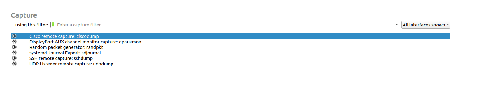
```
sudo dpkg-reconfigure wireshark-common
```
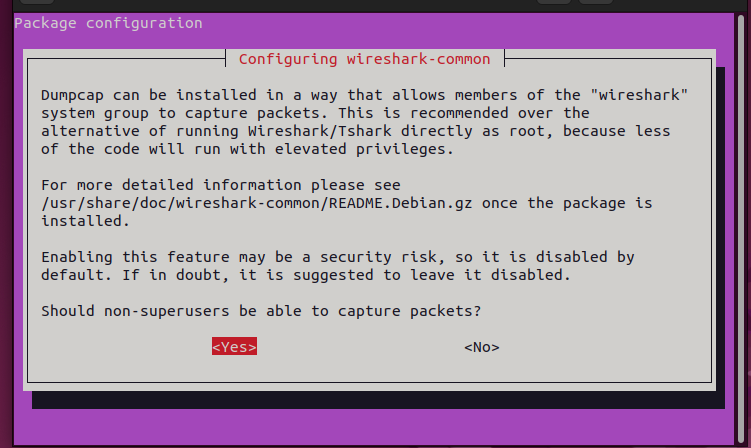
```
sudo usermod -aG wireshark lucy
```
```
newgrp wireshark
```
```
id -nG
```

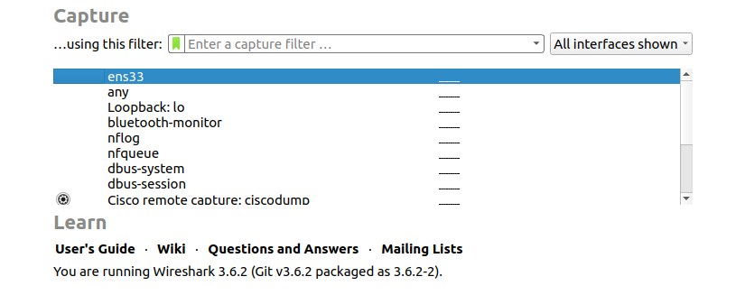

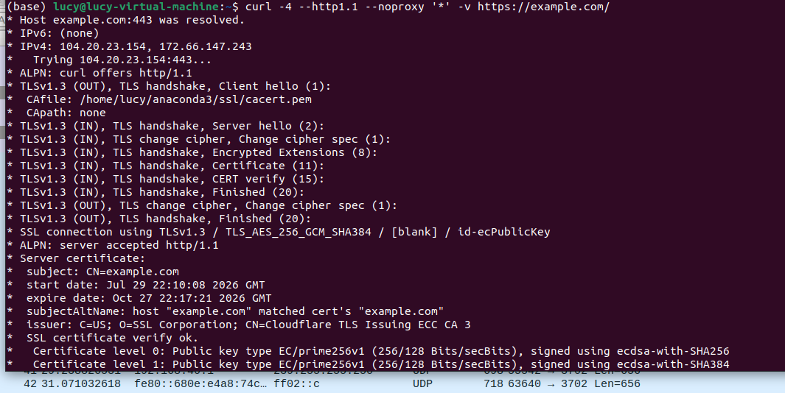
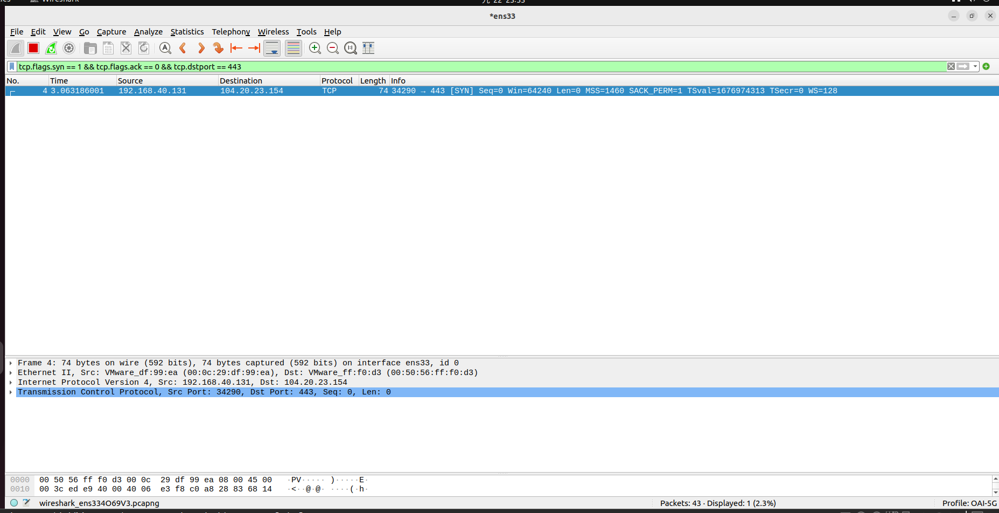
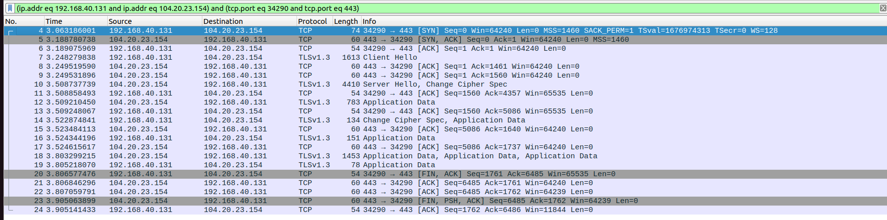

##
# 1. Website Packet Capture

### 1.1 Which website did you access?

I accessed https://example.com/ using HTTPS.

### 1.2 What are the IP address and port number of the website server?

* Server IP address: `104.20.23.154`
* Server port: `443`

### 1.3 What are the IP address and source port number of your PC?

* PC IP address: `192.168.40.131`
* PC source port: `34290`

### 1.4 What is the process of the TCP three-way handshake?

The TCP three-way handshake establishes a TCP connection between the client and server.

**Step 1 — SYN (Packet No. 4)**

The client sends a SYN packet to the server to initiate a TCP connection and synchronize its initial sequence number.

**Step 2 — SYN-ACK (Packet No. 5)**

The server responds with a SYN-ACK packet to acknowledge the client's SYN and synchronize its own initial sequence number.

**Step 3 — ACK (Packet No. 6)**

The client sends an ACK packet to acknowledge the server's SYN. The TCP connection is then established.

After the TCP connection is established, the TLS handshake begins to negotiate a secure HTTPS connection.

**Screenshots:** Insert the TCP SYN, SYN-ACK, ACK, and full handshake screenshots here.

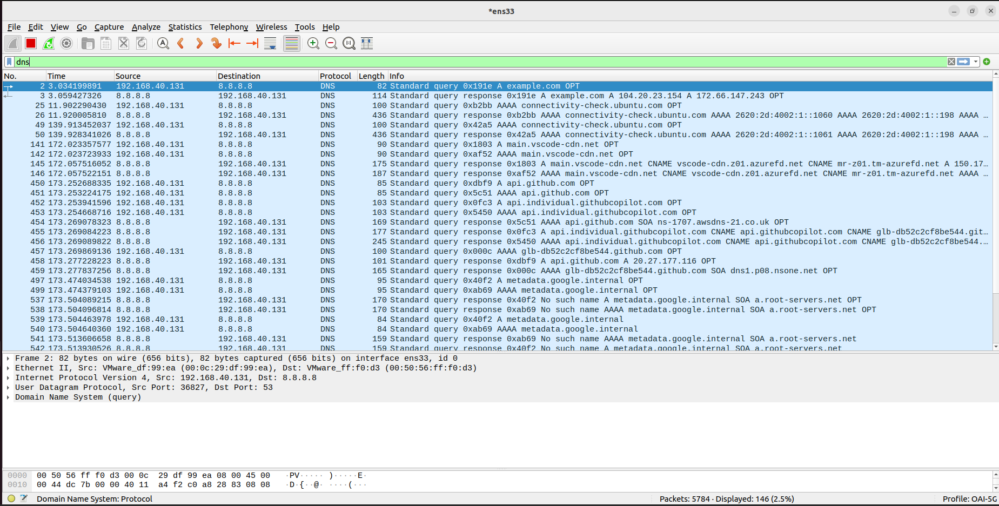
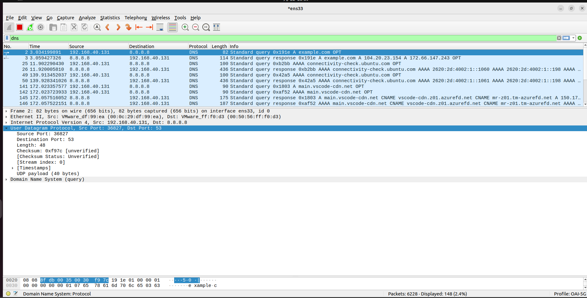
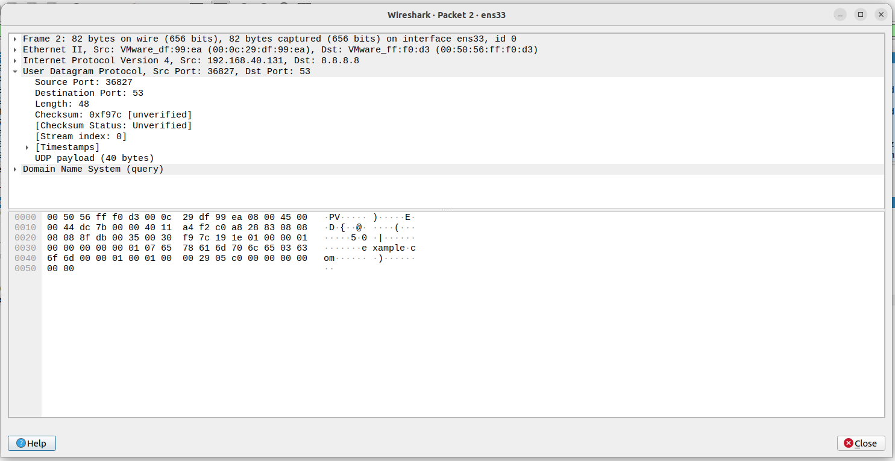
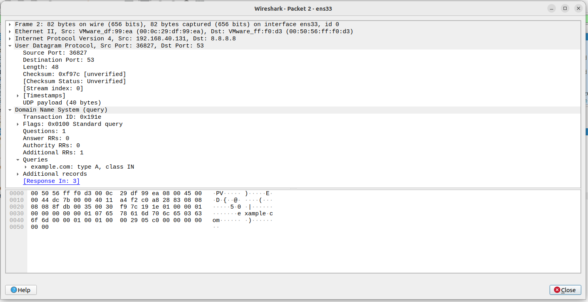
# 2. DNS Packet Analysis

**Display Filter:** `dns`

### 2.1 What are the IP address and port number of the DNS server?

* DNS Server IP Address: `8.8.8.8`
* DNS Server Port: `53`

The DNS query was sent from my PC (`192.168.40.131`) to the DNS server (`8.8.8.8`) using UDP.

### 2.2 What is the domain name in the DNS query?

The domain name is `example.com`.

The DNS query requests an A record, which maps the domain name to IPv4 addresses.

The DNS response contains two IPv4 addresses: `104.20.23.154` and `172.66.147.243`.

### 2.3 Which protocols does this DNS packet use?

| Layer                       | Protocol                           |
| --------------------------- | ---------------------------------- |
| Layer 2 — Link Layer        | Ethernet II                        |
| Layer 3 — Network Layer     | IPv4 (Internet Protocol Version 4) |
| Layer 4 — Transport Layer   | UDP (User Datagram Protocol)       |
| Layer 5 — Application Layer | DNS (Domain Name System)           |

**Screenshots:** Insert the DNS query and protocol stack screenshots here.
---

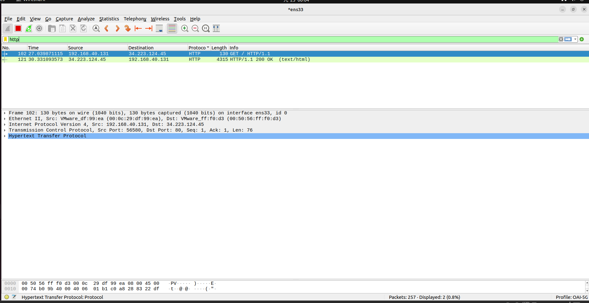
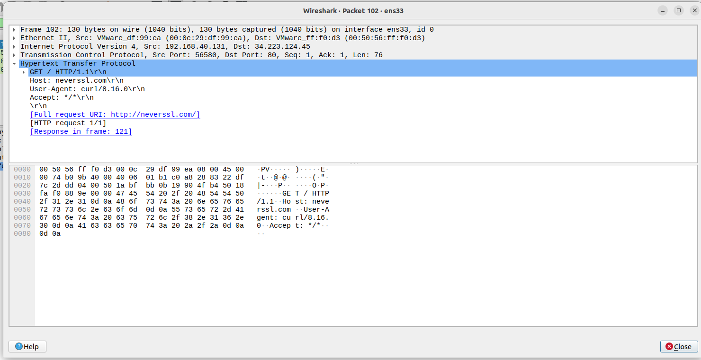

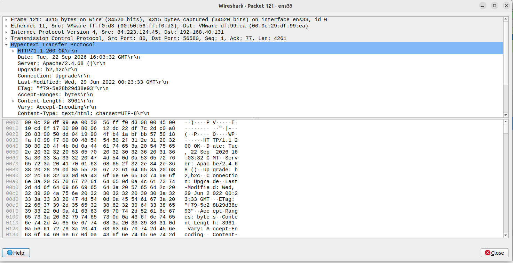
# 3. HTTP Packet Analysis

**Display Filter:** `http`

### 3.1 Which HTTP page did you access?

I accessed http://neverssl.com/ using unencrypted HTTP.

### 3.2 What are the IP address and port number of the server hosting this page?

* Server IP Address: `34.223.124.45`
* Server Port: `80`

### 3.3 What is the HTTP request method?

The HTTP request method is **GET**.

In Packet No. 102, the client sends `GET / HTTP/1.1` to request the webpage from the server.

### 3.4 What is the HTTP response status code, and what does it mean?

The HTTP response status code is **200 OK**.

It indicates that the server successfully processed the request and returned the requested webpage resource.

Packet No. 121 contains the HTTP response, with the content type identified as `text/html`.

**Screenshots:** Insert the HTTP GET request and HTTP 200 OK response screenshots here.
